# King_StudentProfile

## Project Description
A Basic Student Profile application built for ITCC 41 (Mobile Application Development). Started in Activity 2 as a single HTML/CSS page, made responsive in Activity 3, restructured into a five-page application in Activity 4, and extended in Activity 5 with a fully functional Edit Profile feature using JavaScript, DOM manipulation, and localStorage. Packaged and run as an Android application using Apache Cordova.

## Application Pages

### Profile (Homepage)
`index.html` — The entry point of the application. Displays a profile picture, full name, course, year level, an About Me blurb, and skill tags — all rendered dynamically by JavaScript. Includes the main navigation menu, quick-link cards to every other page, and the Edit Profile feature.

### About
`about.html` — A detailed personal introduction: two paragraphs about myself, my interests, my educational background, and my goals.

### Skills
`skills.html` — Five skills organized into two categories (Technical and Professional), each with a proficiency level and a short description.

### Projects
`projects.html` — Three real projects I've worked on: the Basic Student Profile app itself, Courtside GamePlan (a team court-reservation platform), and a solo Cafe Inventory System built in MySQL Workbench.

### Contact
`contact.html` — My email, GitHub, LinkedIn, and location.

## Profile Editing
The Profile page includes an **Edit Profile** button that reveals an in-page form (no navigation or reload) with five fields: Full Name, Course, Year Level, About Me, and Skills.

- **Save** validates that Full Name, Course, Year Level, and About Me are not empty. If valid, it writes the data to `localStorage`, immediately updates the displayed profile using DOM manipulation, and hides the form.
- **Cancel** discards any changes made in the form and returns to the profile view exactly as it was, with no data saved.
- If a required field is left empty, an inline error message appears under that field along with a general "please complete all required fields" message, and saving is blocked until it's fixed.

## JavaScript Functionality
JavaScript handles the entire Edit Profile feature:
- **Form handling** — the Edit Profile button toggles the form's visibility; the form's submit event is intercepted (`event.preventDefault()`) so it updates the page instead of reloading it.
- **Validation** — required fields are checked for empty values before anything is saved, with individual and general error messages shown or hidden as needed.
- **Profile updates** — on save, the profile's name, course/year line, about-me text, and skill tags are rewritten directly in the DOM (`textContent`, dynamically created skill tag elements) so the change appears instantly.
- **Save/Cancel logic** — Save persists data and updates the view; Cancel simply hides the form without touching any saved or displayed data.

## Local Data Storage
Profile data (full name, course, year level, about me, and skills) is stored as a single JSON object in `localStorage` under the key `studentProfile`. On every page load, JavaScript checks for saved data:
- If found, it's parsed and used to populate the profile display.
- If nothing is saved yet (first run), the page falls back to default profile information instead.

Saving the edit form overwrites the stored data, so the updated information is what loads the next time the app is opened — including after fully closing and reopening it.

## Responsive Design
All five pages share one external stylesheet (`css/style.css`), mobile-first with breakpoints at 600px (tablet) and 900px (desktop):
- **Mobile:** content stacks in a single column, comfortable tap targets on nav links and buttons.
- **Tablet:** increased padding, cards arrange into a 2-column grid.
- **Desktop:** cards expand into wider grids, wider max-widths make better use of available space.

The Edit Profile form follows the same responsive rules — full-width fields on mobile, comfortably sized on larger screens.

## How to Run
1. Install Node.js, then install Cordova globally: `npm install -g cordova`
2. Clone this repository and open the project folder in a terminal
3. Add the Android platform: `cordova platform add android`
4. Build the project: `cordova build android`
5. Start an Android emulator (via Android Studio's Device Manager), or connect a physical device with USB debugging enabled
6. Run the app: `cordova run android`

## Application Screenshot
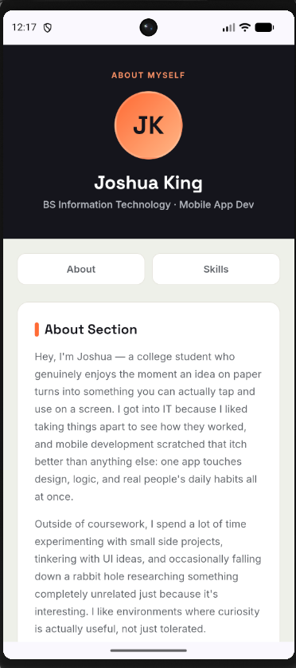
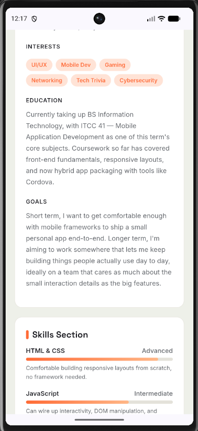
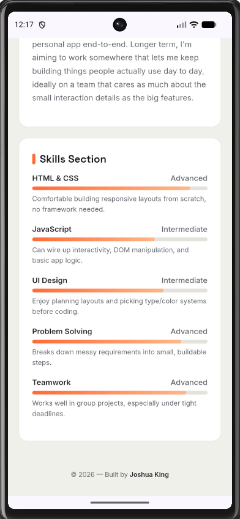
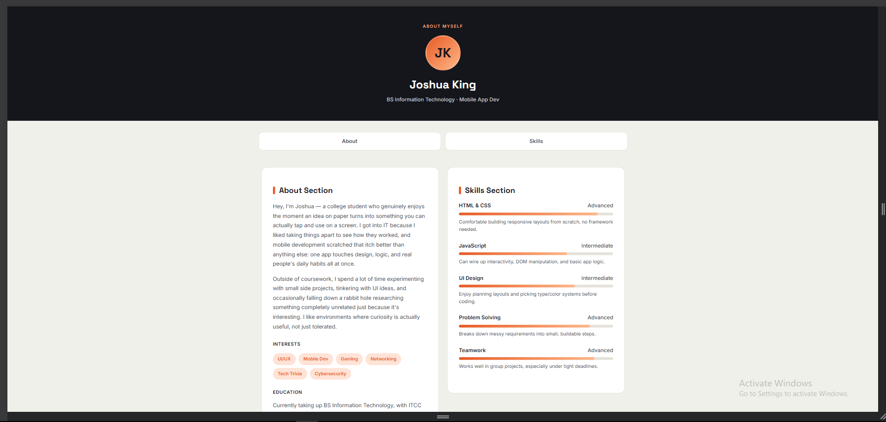
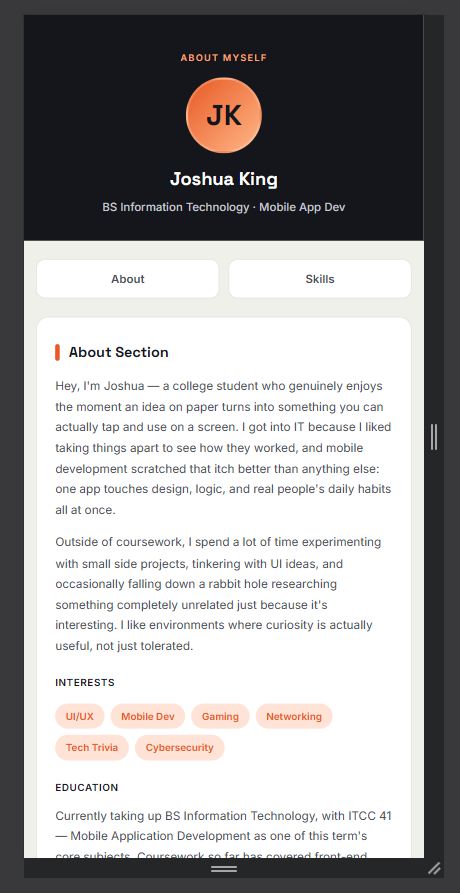
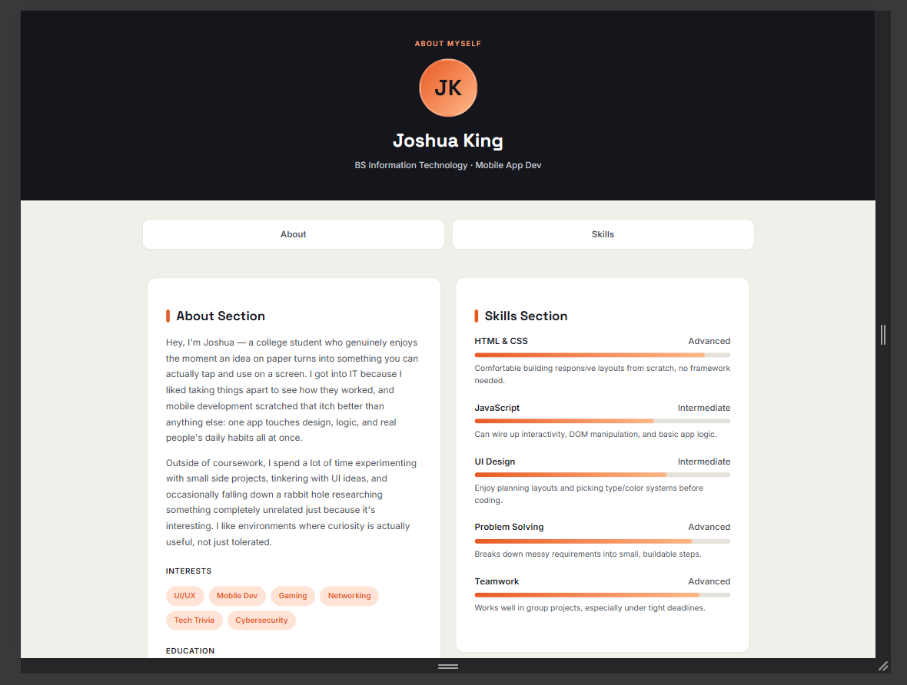

**Profile (Homepage)**
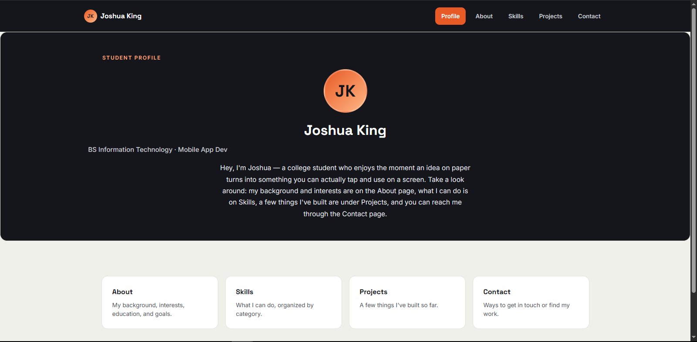

**About**
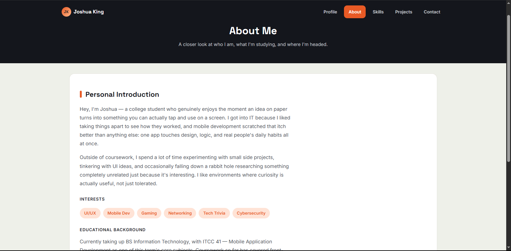

**Skills**
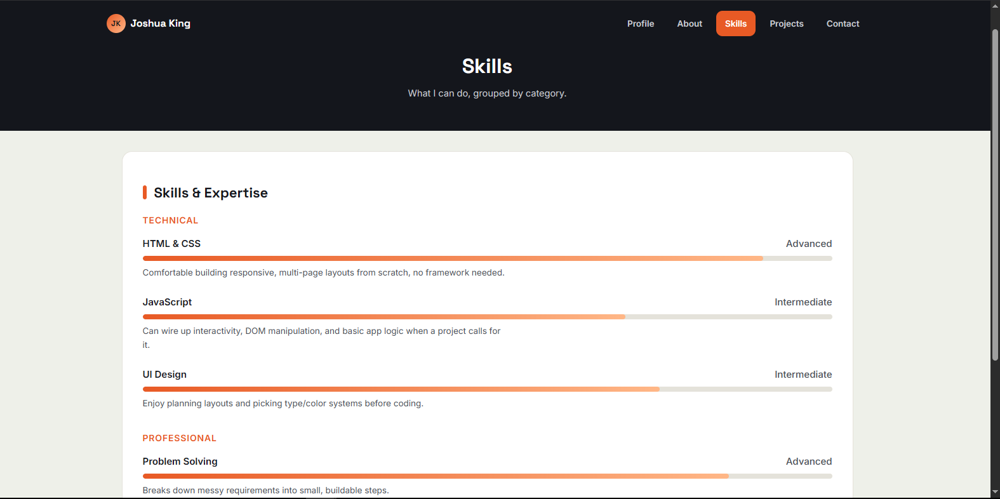

**Projects**
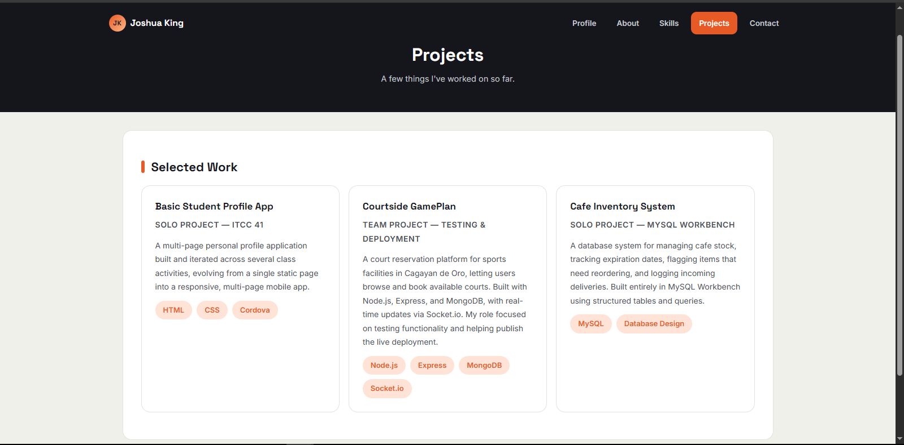

**Contact**
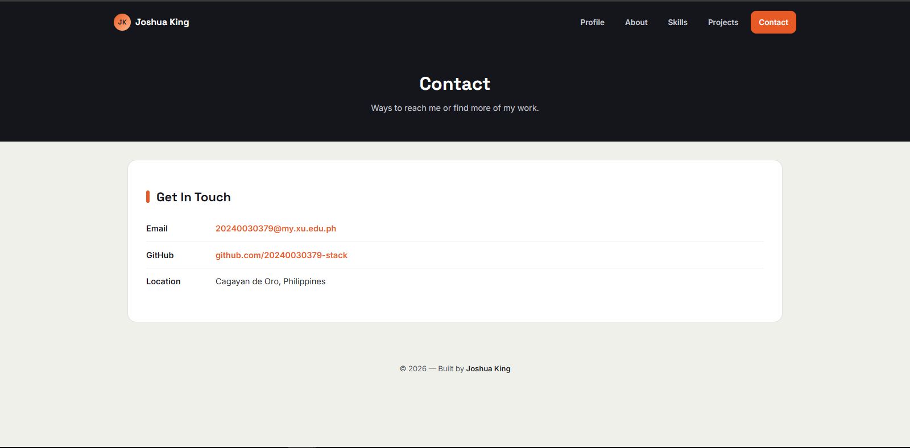

## Author
Joshua King